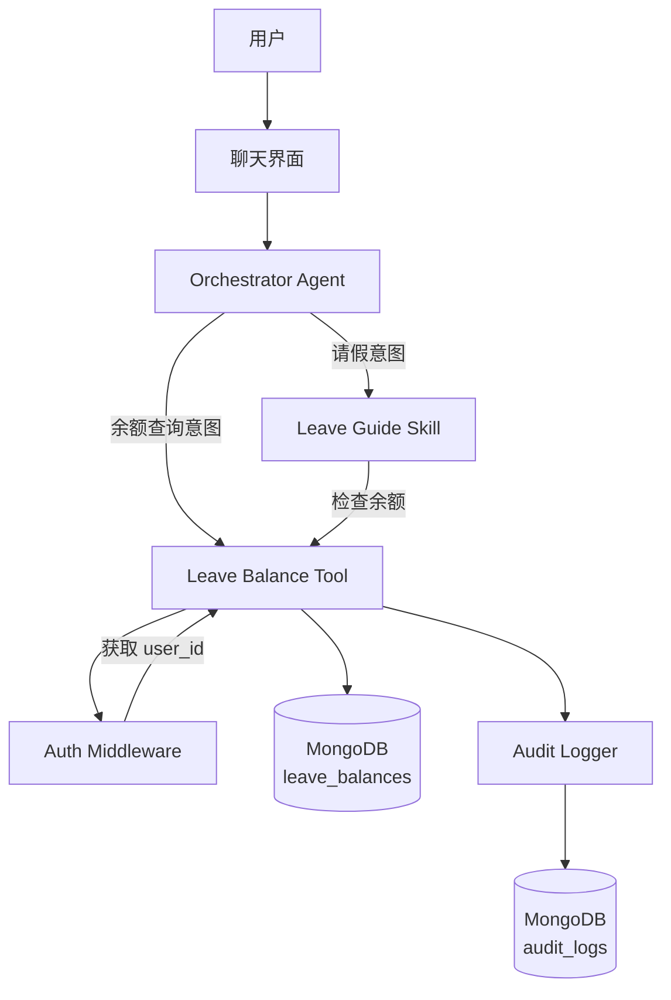
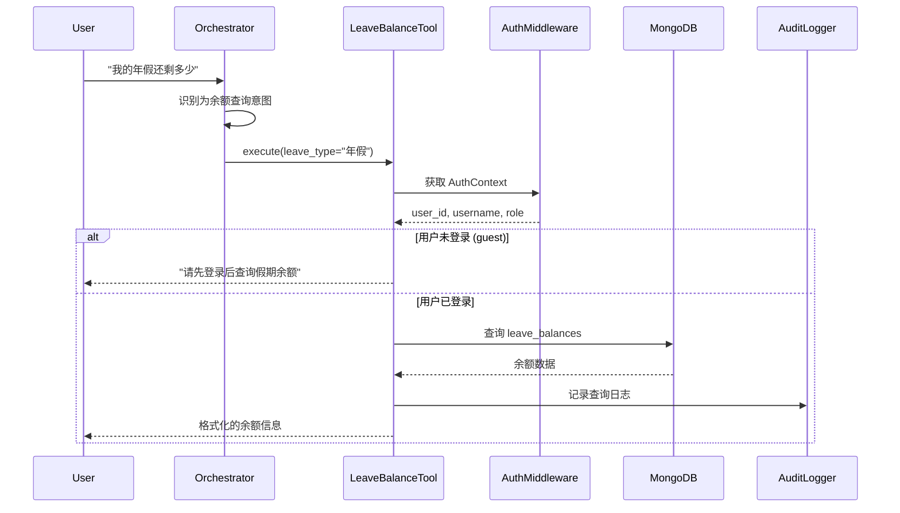
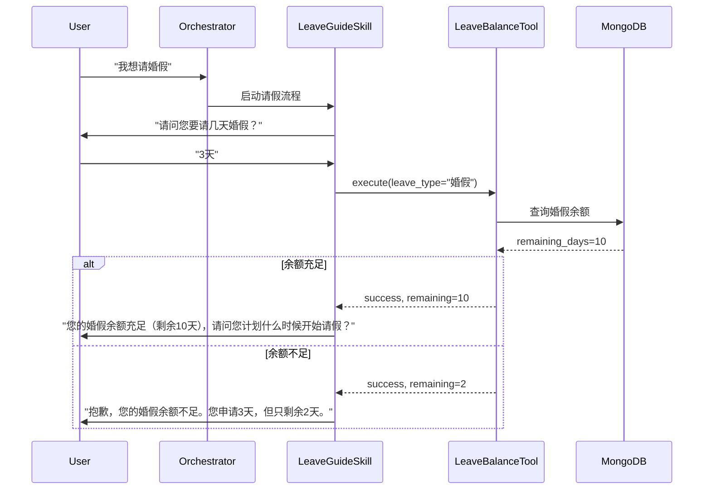

# 技术设计文档：假期余额查询功能

## Overview

本设计文档描述假期余额查询功能的技术实现方案。该功能通过 MCP Tool 架构实现，允许用户查询自己的假期余额，并在请假流程中自动检查余额是否充足。

### 核心目标

1. 实现独立的假期余额查询 MCP Tool
2. 集成权限控制，确保用户只能查询自己的余额
3. 在请假 Skill 中集成余额检查逻辑
4. 支持直接查询和流程内查询两种场景
5. 提供完整的审计日志记录

### 技术栈

- **后端框架**: FastAPI + Python 3.10+
- **数据库**: MongoDB (leave_balances 集合)
- **认证**: MCP Auth Middleware
- **审计**: MCP Audit Logger
- **Tool 框架**: BaseTool + ToolRegistry

### 系统边界

**包含范围**:
- LeaveBalanceTool 实现
- MongoDB leave_balances 集合设计
- Leave_Guide_Skill 余额检查集成
- Orchestrator 意图识别更新
- 审计日志记录

**不包含范围**:
- 假期余额的初始化和更新（由 HR 系统负责）
- 假期申请的提交和审批流程
- 用户认证系统（复用现有 MCP Auth）

## Architecture

### 系统架构图



### 组件交互流程

#### 场景 1: 直接查询余额



#### 场景 2: 请假流程中的余额检查



### 数据流

1. **认证流**: Request → Auth Middleware → AuthContext → Tool
2. **查询流**: Tool → MongoDB → 余额数据 → 格式化 → 用户
3. **审计流**: Tool → Audit Logger → MongoDB audit_logs

## Components and Interfaces

### 1. LeaveBalanceTool

**文件路径**: `backend/app/tools/implementations/leave_balance.py`

**职责**:
- 查询用户假期余额
- 权限验证
- 数据格式化
- 审计日志记录

**接口定义**:

```python
@ToolRegistry.register("check_leave_balance")
class LeaveBalanceTool(BaseTool):
    @property
    def definition(self) -> ToolDefinition:
        return ToolDefinition(
            id="check_leave_balance",
            name="check_leave_balance",
            description="查询当前用户的假期余额。支持查询所有假期类型或指定类型的余额。",
            enabled=True,
            category="leave",
            parameters={
                "type": "object",
                "properties": {
                    "leave_type": {
                        "type": "string",
                        "description": "假期类型（可选）。如：年假、病假、事假、婚假、产假、陪产假、高温假。不指定则返回所有类型。",
                        "enum": ["年假", "病假", "事假", "婚假", "产假", "陪产假", "高温假"]
                    }
                },
                "required": []
            },
            implementation="LeaveBalanceTool"
        )
    
    async def execute(self, leave_type: Optional[str] = None, **kwargs) -> Dict[str, Any]:
        """
        执行余额查询
        
        Args:
            leave_type: 假期类型（可选）
            **kwargs: 包含 auth_context 等上下文信息
        
        Returns:
            {
                "success": bool,
                "balances": List[Dict],  # 余额列表
                "message": str,  # 格式化的文本消息
                "error": Optional[str]
            }
        """
```

**依赖**:
- `app.mcp.auth_middleware.AuthContext`
- `app.mcp.audit_logger.AuditLogger`
- `app.core.mongodb.get_mongo_db`

### 2. MongoDB leave_balances 集合

**集合名称**: `leave_balances`

**文档结构**:

```python
{
    "_id": ObjectId,
    "user_id": str,  # 用户ID
    "username": str,  # 用户名（冗余，便于查询）
    "leave_type": str,  # 假期类型：年假、病假、事假、婚假、产假、陪产假、高温假
    "year": int,  # 年度（如 2024）
    "total_quota": float,  # 总额度（天数），-1 表示无限额
    "used_days": float,  # 已使用天数
    "remaining_days": float,  # 剩余天数，-1 表示无限额
    "updated_at": datetime,  # 最后更新时间
    "created_at": datetime  # 创建时间
}
```

**索引**:

```python
# 复合索引：用户ID + 假期类型 + 年度（唯一）
db.leave_balances.create_index(
    [("user_id", 1), ("leave_type", 1), ("year", 1)],
    unique=True
)

# 单字段索引：用户ID（查询所有余额）
db.leave_balances.create_index([("user_id", 1)])

# 单字段索引：年度（批量更新）
db.leave_balances.create_index([("year", 1)])
```

**示例数据**:

```json
{
    "_id": ObjectId("..."),
    "user_id": "user_001",
    "username": "张三",
    "leave_type": "年假",
    "year": 2024,
    "total_quota": 10.0,
    "used_days": 3.0,
    "remaining_days": 7.0,
    "updated_at": ISODate("2024-01-15T08:00:00Z"),
    "created_at": ISODate("2024-01-01T00:00:00Z")
}
```

### 3. Leave_Guide_Skill 更新

**文件路径**: `backend/app/skills/definitions/leave_guide/SKILL.md`

**更新内容**:

在阶段 2（请假天数确认）之后，添加新的阶段：

```markdown
### 阶段 2.5: 余额检查（新增）

收集完假期类型和天数后，自动调用 check_leave_balance tool 检查余额：

1. 调用 check_leave_balance(leave_type=<用户选择的假期类型>)
2. 检查 remaining_days 是否 >= 用户请求的天数
3. 如果余额不足：
   - 提示用户："抱歉，您的{假期类型}余额不足。您申请{请求天数}天，但只剩余{剩余天数}天。"
   - 询问是否要调整天数或终止流程
4. 如果余额充足：
   - 继续下一阶段
   - 在后续生成的指引中包含余额信息
```

**实现方式**:

在 `backend/app/prompts/config.json` 中更新 `leave_guide_v2` prompt，添加余额检查逻辑。

### 4. Orchestrator Agent 更新

**文件路径**: `backend/app/agents/implementations/orchestrator_agent.py`

**更新内容**:

在 `INTENT_DETECTION_PROMPT` 中添加余额查询意图识别：

```python
INTENT_DETECTION_PROMPT = """你是一个意图识别助手。请判断用户查询属于以下哪种意图：

1. **leave_balance** - 假期余额查询（新增）
   - 用户想查询假期余额、剩余天数
   - 例如：我的假期余额、年假还剩多少、查询假期、还有多少天假
   - 关键特征：包含"余额"、"剩余"、"还有多少"、"查询假期"等词

2. **guide** - 流程指引
   ...（保持原有内容）
```

在 `OrchestratorAgent.run()` 方法中添加处理逻辑：

```python
if intent == "leave_balance":
    logger.info("🎯 [LEAVE_BALANCE] 路由到 LeaveBalanceTool | query='%s'", query)
    # 调用 Tool Executor 执行 check_leave_balance
    result = await tool_executor.execute_tool(
        "check_leave_balance",
        {},
        auth_context=input_data.get("auth_context")
    )
    result["intent"] = "leave_balance"
    return result
```

### 5. Tool Executor 集成

**文件路径**: `backend/app/services/tool_executor.py`

**更新内容**:

确保 `ToolExecutor` 支持传递 `auth_context` 到 Tool：

```python
async def execute_tool(
    self,
    tool_name: str,
    parameters: Dict[str, Any],
    auth_context: Optional[AuthContext] = None
) -> Dict[str, Any]:
    """
    执行指定的 Tool
    
    Args:
        tool_name: Tool 名称
        parameters: Tool 参数
        auth_context: 认证上下文（可选）
    """
    tool = ToolRegistry.get(tool_name)
    
    # 将 auth_context 注入到参数中
    if auth_context:
        parameters["auth_context"] = auth_context
    
    return await tool.execute(**parameters)
```

## Data Models

### LeaveBalance 数据模型

```python
from pydantic import BaseModel, Field
from datetime import datetime
from typing import Optional

class LeaveBalance(BaseModel):
    """假期余额数据模型"""
    user_id: str = Field(..., description="用户ID")
    username: str = Field(..., description="用户名")
    leave_type: str = Field(..., description="假期类型")
    year: int = Field(..., description="年度")
    total_quota: float = Field(..., description="总额度（天），-1表示无限额")
    used_days: float = Field(default=0.0, description="已使用天数")
    remaining_days: float = Field(..., description="剩余天数，-1表示无限额")
    updated_at: datetime = Field(default_factory=datetime.utcnow)
    created_at: datetime = Field(default_factory=datetime.utcnow)
    
    class Config:
        json_encoders = {
            datetime: lambda v: v.isoformat()
        }
    
    @property
    def is_unlimited(self) -> bool:
        """是否无限额度"""
        return self.total_quota == -1
    
    @property
    def is_sufficient(self, requested_days: float) -> bool:
        """检查余额是否充足"""
        if self.is_unlimited:
            return True
        return self.remaining_days >= requested_days
    
    def to_dict(self) -> dict:
        """转换为字典"""
        return {
            "user_id": self.user_id,
            "username": self.username,
            "leave_type": self.leave_type,
            "year": self.year,
            "total_quota": self.total_quota,
            "used_days": self.used_days,
            "remaining_days": self.remaining_days,
            "updated_at": self.updated_at,
            "created_at": self.created_at
        }
```

### LeaveBalanceResponse 响应模型

```python
class LeaveBalanceResponse(BaseModel):
    """假期余额查询响应"""
    success: bool = Field(..., description="是否成功")
    balances: List[LeaveBalance] = Field(default_factory=list, description="余额列表")
    message: str = Field(..., description="格式化的文本消息")
    error: Optional[str] = Field(None, description="错误信息")
    timestamp: datetime = Field(default_factory=datetime.utcnow, description="查询时间")
```

### 假期类型枚举

```python
from enum import Enum

class LeaveType(str, Enum):
    """假期类型枚举"""
    ANNUAL = "年假"
    SICK = "病假"
    PERSONAL = "事假"
    MARRIAGE = "婚假"
    MATERNITY = "产假"
    PATERNITY = "陪产假"
    HIGH_TEMP = "高温假"
    
    @classmethod
    def is_unlimited(cls, leave_type: str) -> bool:
        """判断假期类型是否无限额"""
        unlimited_types = [cls.SICK, cls.PERSONAL]
        return leave_type in [t.value for t in unlimited_types]
    
    @classmethod
    def get_display_name(cls, leave_type: str) -> str:
        """获取显示名称"""
        return leave_type
```

