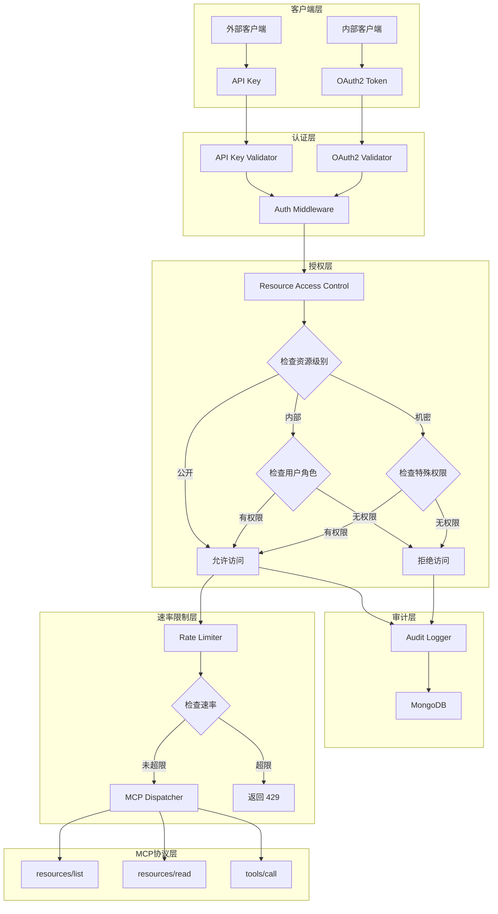
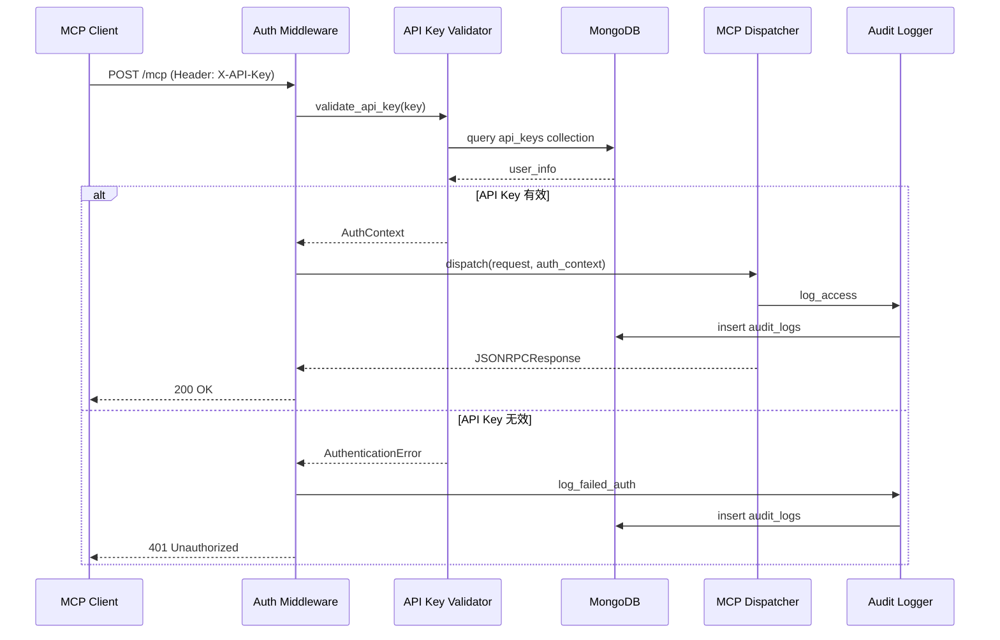
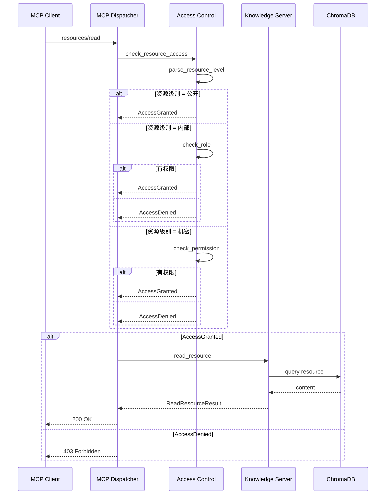

# 设计文档：MCP 资源公开访问（mcp-resource-public-access）

## 概述

本设计旨在为现有 MCP 标准实现添加认证与授权机制，使静态资源知识库（通过 MCP Resources 能力）可以安全地对外开放访问。

当前 MCP 端点（HTTP POST /mcp 和 SSE /mcp/sse）没有认证机制，不适合对外开放。本设计将引入 API Key 认证、资源分级访问控制、审计日志、速率限制等安全机制，同时保持与 MCP 协议规范的完整兼容性。

核心目标：
- 为 MCP 端点添加 API Key 认证机制
- 实现资源三级分类（公开、内部、机密）
- 基于用户身份和资源级别的访问控制
- 完整的审计日志记录
- 防止 API 滥用的速率限制
- 提供公开资源目录供外部用户浏览

## 架构

### 整体架构图




### 认证流程序列图



### 资源访问控制序列图




## 组件与接口

### 1. 认证中间件（Auth Middleware）

**文件路径**: `backend/app/mcp/auth_middleware.py`

**职责**: 拦截所有 MCP 请求，验证 API Key 或 OAuth2 Token，构建认证上下文

**接口定义**:

```python
from typing import Optional
from fastapi import Request, HTTPException, status
from pydantic import BaseModel

class AuthContext(BaseModel):
    """认证上下文，包含用户身份和权限信息"""
    user_id: str
    username: str
    role: str  # guest, employee, admin
    permissions: list[str]  # 特殊权限列表
    rate_limit: int  # 每分钟请求限制
    api_key: str

class MCPAuthMiddleware:
    """MCP 认证中间件"""
    
    async def authenticate_request(self, request: Request) -> AuthContext:
        """
        从请求中提取认证信息并验证
        
        支持两种认证方式：
        1. API Key: Header X-API-Key
        2. OAuth2: Header Authorization: Bearer <token>
        
        返回: AuthContext 认证上下文
        抛出: HTTPException 401 如果认证失败
        """
        pass
    
    async def validate_api_key(self, api_key: str) -> Optional[AuthContext]:
        """验证 API Key 并返回用户信息"""
        pass
    
    async def validate_oauth_token(self, token: str) -> Optional[AuthContext]:
        """验证 OAuth2 Token 并返回用户信息"""
        pass
```

**前置条件**:
- API Key 或 OAuth2 Token 必须在请求头中提供
- API Key 格式: `X-API-Key: mcp_<32位随机字符>`
- OAuth2 Token 格式: `Authorization: Bearer <jwt_token>`

**后置条件**:
- 成功: 返回有效的 AuthContext 对象
- 失败: 抛出 HTTPException 401 Unauthorized
- 所有认证尝试都被记录到审计日志


### 2. 资源访问控制（Resource Access Control）

**文件路径**: `backend/app/mcp/access_control.py`

**职责**: 检查用户对特定资源的访问权限

**接口定义**:

```python
from enum import Enum
from typing import Optional

class ResourceLevel(str, Enum):
    """资源访问级别"""
    PUBLIC = "public"        # 公开：任何人可访问
    INTERNAL = "internal"    # 内部：需要员工角色
    CONFIDENTIAL = "confidential"  # 机密：需要特殊权限

class ResourceAccessControl:
    """资源访问控制"""
    
    def parse_resource_level(self, uri: str) -> ResourceLevel:
        """
        从资源 URI 解析访问级别
        
        URI 格式约定：
        - knowledge://public/* -> PUBLIC
        - knowledge://internal/* -> INTERNAL
        - knowledge://confidential/* -> CONFIDENTIAL
        - document://public/* -> PUBLIC
        - document://internal/* -> INTERNAL
        - document://confidential/* -> CONFIDENTIAL
        
        默认: INTERNAL
        """
        pass
    
    def check_access(self, uri: str, auth_context: AuthContext) -> bool:
        """
        检查用户是否有权访问指定资源
        
        访问规则：
        - PUBLIC: 所有用户可访问
        - INTERNAL: role in [employee, admin]
        - CONFIDENTIAL: "confidential_access" in permissions
        
        返回: True 允许访问, False 拒绝访问
        """
        pass
    
    def filter_resources(
        self, 
        resources: list[MCPResource], 
        auth_context: AuthContext
    ) -> list[MCPResource]:
        """
        根据用户权限过滤资源列表
        只返回用户有权访问的资源
        """
        pass
```

**前置条件**:
- uri 必须是有效的资源 URI
- auth_context 必须是已验证的认证上下文

**后置条件**:
- check_access 返回布尔值，不抛出异常
- filter_resources 返回过滤后的资源列表
- 所有访问检查都被记录到审计日志


### 3. 审计日志（Audit Logger）

**文件路径**: `backend/app/mcp/audit_logger.py`

**职责**: 记录所有 MCP 访问行为到 MongoDB

**接口定义**:

```python
from datetime import datetime
from typing import Optional

class AuditEvent(BaseModel):
    """审计事件"""
    timestamp: datetime
    user_id: str
    username: str
    api_key: str  # 脱敏后的 API Key (前8位)
    method: str  # JSON-RPC 方法名
    resource_uri: Optional[str]  # 访问的资源 URI
    tool_name: Optional[str]  # 调用的工具名
    success: bool  # 是否成功
    error_code: Optional[int]  # 错误码
    error_message: Optional[str]  # 错误信息
    ip_address: str
    user_agent: str
    response_time_ms: int  # 响应时间（毫秒）

class AuditLogger:
    """审计日志记录器"""
    
    async def log_access(
        self,
        auth_context: AuthContext,
        method: str,
        resource_uri: Optional[str],
        tool_name: Optional[str],
        success: bool,
        error_code: Optional[int],
        error_message: Optional[str],
        request: Request,
        response_time_ms: int
    ) -> None:
        """记录访问事件到 MongoDB audit_logs 集合"""
        pass
    
    async def log_failed_auth(
        self,
        api_key: str,
        request: Request,
        error_message: str
    ) -> None:
        """记录认证失败事件"""
        pass
    
    async def get_user_access_history(
        self,
        user_id: str,
        limit: int = 100
    ) -> list[AuditEvent]:
        """查询用户访问历史"""
        pass
    
    async def get_resource_access_stats(
        self,
        resource_uri: str,
        days: int = 7
    ) -> dict:
        """获取资源访问统计"""
        pass
```

**前置条件**:
- MongoDB 连接已建立
- audit_logs 集合已创建索引

**后置条件**:
- 所有事件都被持久化到 MongoDB
- 敏感信息（完整 API Key）不被记录
- 日志写入失败不影响主流程


### 4. 速率限制（Rate Limiter）

**文件路径**: `backend/app/mcp/rate_limiter.py`

**职责**: 防止 API 滥用和 DDoS 攻击

**接口定义**:

```python
from typing import Optional
import time

class RateLimitExceeded(Exception):
    """速率限制超出异常"""
    pass

class RateLimiter:
    """速率限制器（基于滑动窗口算法）"""
    
    def __init__(self):
        # 使用 Redis 或内存存储请求计数
        self.storage = {}  # {user_id: [(timestamp, count), ...]}
    
    async def check_rate_limit(
        self,
        user_id: str,
        rate_limit: int,  # 每分钟请求数
        window_seconds: int = 60
    ) -> bool:
        """
        检查用户是否超出速率限制
        
        算法: 滑动窗口
        - 记录用户在时间窗口内的请求次数
        - 超出限制返回 False
        - 未超出限制返回 True 并记录本次请求
        
        返回: True 允许请求, False 拒绝请求
        """
        pass
    
    async def get_remaining_quota(
        self,
        user_id: str,
        rate_limit: int,
        window_seconds: int = 60
    ) -> int:
        """获取用户剩余配额"""
        pass
    
    async def reset_user_quota(self, user_id: str) -> None:
        """重置用户配额（管理员操作）"""
        pass
```

**前置条件**:
- user_id 和 rate_limit 必须有效
- 时间窗口 window_seconds > 0

**后置条件**:
- 超出限制时抛出 RateLimitExceeded 异常
- 请求计数准确记录
- 过期的计数自动清理


### 5. API Key 管理（API Key Manager）

**文件路径**: `backend/app/mcp/api_key_manager.py`

**职责**: 管理 API Key 的生成、验证、撤销

**接口定义**:

```python
import secrets
from datetime import datetime, timedelta
from typing import Optional

class APIKey(BaseModel):
    """API Key 模型"""
    key: str  # mcp_<32位随机字符>
    user_id: str
    username: str
    role: str
    permissions: list[str]
    rate_limit: int
    created_at: datetime
    expires_at: Optional[datetime]
    is_active: bool
    last_used_at: Optional[datetime]
    description: str  # API Key 用途描述

class APIKeyManager:
    """API Key 管理器"""
    
    async def generate_api_key(
        self,
        user_id: str,
        username: str,
        role: str,
        permissions: list[str],
        rate_limit: int,
        expires_days: Optional[int],
        description: str
    ) -> APIKey:
        """
        生成新的 API Key
        
        格式: mcp_<32位随机字符>
        存储: MongoDB api_keys 集合
        
        返回: APIKey 对象
        """
        pass
    
    async def validate_api_key(self, key: str) -> Optional[APIKey]:
        """
        验证 API Key 并返回关联信息
        
        检查:
        - Key 是否存在
        - 是否已过期
        - 是否被撤销
        
        副作用: 更新 last_used_at
        """
        pass
    
    async def revoke_api_key(self, key: str) -> bool:
        """撤销 API Key"""
        pass
    
    async def list_user_api_keys(self, user_id: str) -> list[APIKey]:
        """列出用户的所有 API Keys"""
        pass
    
    async def cleanup_expired_keys(self) -> int:
        """清理过期的 API Keys，返回清理数量"""
        pass
```

**前置条件**:
- MongoDB api_keys 集合已创建
- user_id 必须是有效的用户 ID

**后置条件**:
- 生成的 API Key 唯一且安全
- 过期的 Key 自动失效
- 撤销操作立即生效


### 6. 增强的 MCP Dispatcher

**文件路径**: `backend/app/mcp/dispatcher.py` (修改现有文件)

**职责**: 在现有 Dispatcher 基础上集成认证、授权、审计、速率限制

**接口修改**:

```python
class MCPDispatcher:
    """MCP 请求分发器（增强版）"""
    
    def __init__(
        self,
        registry: MCPServerRegistry,
        access_control: ResourceAccessControl,
        audit_logger: AuditLogger,
        rate_limiter: RateLimiter
    ):
        self.registry = registry
        self.access_control = access_control
        self.audit_logger = audit_logger
        self.rate_limiter = rate_limiter
    
    async def dispatch(
        self,
        request: JSONRPCRequest,
        auth_context: Optional[AuthContext] = None
    ) -> Optional[JSONRPCResponse]:
        """
        主入口：根据 method 路由到对应处理方法
        
        增强功能：
        1. 速率限制检查
        2. 访问权限检查（针对 resources/* 方法）
        3. 审计日志记录
        4. 性能监控
        """
        pass
    
    async def _handle_resources_list(
        self,
        params: Dict,
        auth_context: Optional[AuthContext]
    ) -> Dict:
        """
        列出资源（增强版）
        
        根据用户权限过滤资源列表
        - 未认证用户: 只返回 PUBLIC 资源
        - 员工用户: 返回 PUBLIC + INTERNAL 资源
        - 管理员: 返回所有资源
        """
        pass
    
    async def _handle_resources_read(
        self,
        params: Dict,
        auth_context: Optional[AuthContext]
    ) -> Dict:
        """
        读取资源（增强版）
        
        在读取前检查访问权限
        - 无权限: 返回 403 Forbidden
        - 有权限: 正常返回资源内容
        """
        pass
```

**前置条件**:
- 所有依赖组件已初始化
- auth_context 在需要认证的端点中必须提供

**后置条件**:
- 所有请求都经过速率限制检查
- 资源访问都经过权限检查
- 所有操作都被审计记录


### 7. 增强的 MCP Router

**文件路径**: `backend/app/mcp/router.py` (修改现有文件)

**职责**: 在路由层集成认证中间件

**接口修改**:

```python
from fastapi import APIRouter, Request, Depends
from app.mcp.auth_middleware import MCPAuthMiddleware, AuthContext

router = APIRouter(prefix="/mcp", tags=["mcp"])
auth_middleware = MCPAuthMiddleware()

async def get_auth_context(request: Request) -> Optional[AuthContext]:
    """依赖注入：获取认证上下文"""
    try:
        return await auth_middleware.authenticate_request(request)
    except HTTPException:
        # 对于公开端点，认证失败返回 None（guest 用户）
        return None

@router.post("")
async def mcp_endpoint(
    request: Request,
    auth_context: Optional[AuthContext] = Depends(get_auth_context)
) -> JSONResponse:
    """
    HTTP POST 端点（增强版）
    
    认证策略：
    - 提供有效 API Key: 以认证用户身份访问
    - 未提供或无效: 以 guest 身份访问（仅限公开资源）
    """
    pass

@router.get("/sse")
async def mcp_sse_endpoint(
    request: Request,
    auth_context: Optional[AuthContext] = Depends(get_auth_context)
) -> StreamingResponse:
    """SSE 端点（增强版）"""
    pass

@router.get("/public/resources")
async def list_public_resources() -> JSONResponse:
    """
    公开资源目录（新增）
    
    无需认证，返回所有 PUBLIC 级别的资源列表
    供外部用户浏览可用资源
    """
    pass

@router.post("/admin/api-keys")
async def create_api_key(
    request: Request,
    auth_context: AuthContext = Depends(get_auth_context)
) -> JSONResponse:
    """
    创建 API Key（新增，管理员端点）
    
    需要 admin 角色
    """
    pass

@router.delete("/admin/api-keys/{key}")
async def revoke_api_key(
    key: str,
    auth_context: AuthContext = Depends(get_auth_context)
) -> JSONResponse:
    """
    撤销 API Key（新增，管理员端点）
    
    需要 admin 角色
    """
    pass

@router.get("/admin/audit-logs")
async def get_audit_logs(
    request: Request,
    auth_context: AuthContext = Depends(get_auth_context)
) -> JSONResponse:
    """
    查询审计日志（新增，管理员端点）
    
    需要 admin 角色
    """
    pass
```


## 数据模型

### MongoDB 集合设计

#### 1. api_keys 集合

```python
{
    "_id": ObjectId,
    "key": "mcp_a1b2c3d4e5f6g7h8i9j0k1l2m3n4o5p6",  # 唯一索引
    "user_id": "user_123",
    "username": "john.doe",
    "role": "employee",  # guest, employee, admin
    "permissions": ["confidential_access"],  # 特殊权限列表
    "rate_limit": 100,  # 每分钟请求数
    "created_at": ISODate("2024-01-01T00:00:00Z"),
    "expires_at": ISODate("2024-12-31T23:59:59Z"),  # null 表示永不过期
    "is_active": true,
    "last_used_at": ISODate("2024-01-15T10:30:00Z"),
    "description": "用于外部系统集成"
}
```

**索引**:
- `key`: 唯一索引
- `user_id`: 普通索引
- `is_active`: 普通索引
- `expires_at`: TTL 索引（自动清理过期记录）

#### 2. audit_logs 集合

```python
{
    "_id": ObjectId,
    "timestamp": ISODate("2024-01-15T10:30:00Z"),
    "user_id": "user_123",
    "username": "john.doe",
    "api_key_prefix": "mcp_a1b2c3d4",  # 脱敏后的 API Key
    "method": "resources/read",
    "resource_uri": "knowledge://internal/policy/leave",
    "tool_name": null,
    "success": true,
    "error_code": null,
    "error_message": null,
    "ip_address": "192.168.1.100",
    "user_agent": "MCP-Client/1.0",
    "response_time_ms": 150
}
```

**索引**:
- `timestamp`: 降序索引（用于时间范围查询）
- `user_id`: 普通索引
- `resource_uri`: 普通索引
- `success`: 普通索引
- 复合索引: `(user_id, timestamp)`

#### 3. rate_limit_records 集合（可选，使用 Redis 更佳）

```python
{
    "_id": ObjectId,
    "user_id": "user_123",
    "window_start": ISODate("2024-01-15T10:30:00Z"),
    "request_count": 45,
    "expires_at": ISODate("2024-01-15T10:31:00Z")  # TTL 索引
}
```

**索引**:
- `user_id`: 唯一索引
- `expires_at`: TTL 索引


### 资源 URI 命名约定

为了支持资源分级访问控制，资源 URI 需要遵循以下命名约定：

```
<scheme>://<level>/<category>/<resource_name>

scheme: knowledge | document
level: public | internal | confidential
category: policy | guide | faq | manual
resource_name: 具体资源名称
```

**示例**:

```python
# 公开资源
"knowledge://public/faq/general"
"document://public/guide/getting-started"

# 内部资源
"knowledge://internal/policy/leave"
"document://internal/manual/employee-handbook"

# 机密资源
"knowledge://confidential/policy/salary"
"document://confidential/financial/budget-2024"
```

**兼容性处理**:

对于现有不符合约定的 URI，默认视为 INTERNAL 级别：

```python
"knowledge://index" -> INTERNAL
"document://doc_123" -> INTERNAL
```


## 算法伪代码

### 认证流程算法

```python
ALGORITHM authenticate_request(request)
INPUT: request (HTTP Request 对象)
OUTPUT: auth_context (AuthContext 对象或 None)

BEGIN
  # 步骤 1: 提取认证凭证
  api_key ← extract_header(request, "X-API-Key")
  oauth_token ← extract_header(request, "Authorization")
  
  # 步骤 2: 优先使用 API Key 认证
  IF api_key IS NOT NULL THEN
    auth_context ← validate_api_key(api_key)
    IF auth_context IS NOT NULL THEN
      RETURN auth_context
    ELSE
      log_failed_auth(api_key, request, "Invalid API Key")
      RAISE HTTPException(401, "Invalid API Key")
    END IF
  END IF
  
  # 步骤 3: 尝试 OAuth2 认证
  IF oauth_token IS NOT NULL THEN
    auth_context ← validate_oauth_token(oauth_token)
    IF auth_context IS NOT NULL THEN
      RETURN auth_context
    ELSE
      log_failed_auth(oauth_token, request, "Invalid OAuth Token")
      RAISE HTTPException(401, "Invalid OAuth Token")
    END IF
  END IF
  
  # 步骤 4: 无认证凭证，返回 guest 上下文
  RETURN create_guest_context()
END
```

**前置条件**:
- request 是有效的 HTTP Request 对象
- MongoDB 连接已建立

**后置条件**:
- 返回有效的 AuthContext 或抛出 HTTPException
- 所有认证尝试都被记录

**循环不变式**: N/A（无循环）


### 资源访问控制算法

```python
ALGORITHM check_resource_access(uri, auth_context)
INPUT: uri (资源 URI 字符串), auth_context (AuthContext 对象)
OUTPUT: access_granted (布尔值)

BEGIN
  # 步骤 1: 解析资源级别
  level ← parse_resource_level(uri)
  
  # 步骤 2: 根据级别检查权限
  IF level = PUBLIC THEN
    RETURN true  # 公开资源，所有人可访问
  END IF
  
  IF level = INTERNAL THEN
    IF auth_context.role IN ["employee", "admin"] THEN
      RETURN true
    ELSE
      RETURN false
    END IF
  END IF
  
  IF level = CONFIDENTIAL THEN
    IF "confidential_access" IN auth_context.permissions THEN
      RETURN true
    ELSE
      RETURN false
    END IF
  END IF
  
  # 默认拒绝访问
  RETURN false
END

ALGORITHM parse_resource_level(uri)
INPUT: uri (资源 URI 字符串)
OUTPUT: level (ResourceLevel 枚举)

BEGIN
  # 步骤 1: 提取 URI 路径部分
  IF uri CONTAINS "://public/" THEN
    RETURN PUBLIC
  ELSE IF uri CONTAINS "://internal/" THEN
    RETURN INTERNAL
  ELSE IF uri CONTAINS "://confidential/" THEN
    RETURN CONFIDENTIAL
  ELSE
    # 默认为内部资源
    RETURN INTERNAL
  END IF
END
```

**前置条件**:
- uri 是非空字符串
- auth_context 是有效的认证上下文

**后置条件**:
- 返回布尔值，不抛出异常
- 访问决策被记录到审计日志

**循环不变式**: N/A（无循环）


### 速率限制算法（滑动窗口）

```python
ALGORITHM check_rate_limit(user_id, rate_limit, window_seconds)
INPUT: user_id (用户ID), rate_limit (每窗口请求数), window_seconds (时间窗口秒数)
OUTPUT: allowed (布尔值)

BEGIN
  # 步骤 1: 获取当前时间戳
  current_time ← get_current_timestamp()
  window_start ← current_time - window_seconds
  
  # 步骤 2: 获取用户在时间窗口内的请求记录
  request_records ← get_user_requests(user_id)
  
  # 步骤 3: 过滤出时间窗口内的请求
  valid_requests ← []
  FOR EACH record IN request_records DO
    IF record.timestamp >= window_start THEN
      valid_requests.append(record)
    END IF
  END FOR
  
  # 步骤 4: 检查是否超出限制
  request_count ← length(valid_requests)
  
  IF request_count >= rate_limit THEN
    # 超出限制
    log_rate_limit_exceeded(user_id, request_count, rate_limit)
    RETURN false
  ELSE
    # 未超出限制，记录本次请求
    record_request(user_id, current_time)
    RETURN true
  END IF
END
```

**前置条件**:
- user_id 是有效的用户标识
- rate_limit > 0
- window_seconds > 0

**后置条件**:
- 返回 true 表示允许请求，false 表示拒绝
- 允许的请求被记录到存储中
- 过期的请求记录被清理

**循环不变式**:
- 在遍历 request_records 时，valid_requests 中的所有记录的 timestamp >= window_start


### API Key 生成算法

```python
ALGORITHM generate_api_key(user_id, username, role, permissions, rate_limit, expires_days, description)
INPUT: user_id, username, role, permissions, rate_limit, expires_days, description
OUTPUT: api_key (APIKey 对象)

BEGIN
  # 步骤 1: 生成安全的随机密钥
  random_bytes ← generate_secure_random(32)  # 32 字节 = 256 位
  key_suffix ← encode_hex(random_bytes)  # 转换为 64 位十六进制字符串
  key ← "mcp_" + key_suffix
  
  # 步骤 2: 检查密钥唯一性
  WHILE key_exists_in_database(key) DO
    # 极低概率的碰撞，重新生成
    random_bytes ← generate_secure_random(32)
    key_suffix ← encode_hex(random_bytes)
    key ← "mcp_" + key_suffix
  END WHILE
  
  # 步骤 3: 计算过期时间
  created_at ← get_current_datetime()
  IF expires_days IS NOT NULL THEN
    expires_at ← created_at + timedelta(days=expires_days)
  ELSE
    expires_at ← NULL  # 永不过期
  END IF
  
  # 步骤 4: 创建 API Key 对象
  api_key ← APIKey(
    key=key,
    user_id=user_id,
    username=username,
    role=role,
    permissions=permissions,
    rate_limit=rate_limit,
    created_at=created_at,
    expires_at=expires_at,
    is_active=true,
    last_used_at=NULL,
    description=description
  )
  
  # 步骤 5: 保存到数据库
  save_to_database(api_key)
  
  RETURN api_key
END
```

**前置条件**:
- user_id 是有效的用户 ID
- role 在 ["guest", "employee", "admin"] 中
- rate_limit > 0
- MongoDB 连接已建立

**后置条件**:
- 返回的 API Key 唯一且安全
- API Key 已持久化到数据库
- 密钥长度为 68 字符（"mcp_" + 64 位十六进制）

**循环不变式**:
- 在 WHILE 循环中，每次迭代都生成新的随机密钥
- 循环终止条件：生成的密钥在数据库中不存在


## 关键函数形式化规范

### 函数 1: authenticate_request()

```python
async def authenticate_request(request: Request) -> AuthContext
```

**前置条件**:
- `request` 是有效的 FastAPI Request 对象
- MongoDB 连接已建立且可用
- `request.headers` 可访问

**后置条件**:
- 如果认证成功：返回有效的 `AuthContext` 对象，其中 `user_id` 非空
- 如果认证失败：抛出 `HTTPException` 状态码 401
- 所有认证尝试（成功或失败）都被记录到 `audit_logs` 集合
- 如果无认证凭证：返回 guest 用户的 `AuthContext`（role="guest"）

**循环不变式**: N/A（函数不包含循环）

---

### 函数 2: check_resource_access()

```python
def check_access(uri: str, auth_context: AuthContext) -> bool
```

**前置条件**:
- `uri` 是非空字符串
- `auth_context` 是有效的 `AuthContext` 对象
- `auth_context.role` 在 ["guest", "employee", "admin"] 中

**后置条件**:
- 返回布尔值，不抛出异常
- 返回 `true` 当且仅当：
  - 资源级别为 PUBLIC，或
  - 资源级别为 INTERNAL 且 `auth_context.role` in ["employee", "admin"]，或
  - 资源级别为 CONFIDENTIAL 且 "confidential_access" in `auth_context.permissions`
- 访问决策被记录到审计日志

**循环不变式**: N/A（函数不包含循环）

---

### 函数 3: check_rate_limit()

```python
async def check_rate_limit(user_id: str, rate_limit: int, window_seconds: int) -> bool
```

**前置条件**:
- `user_id` 是非空字符串
- `rate_limit` > 0
- `window_seconds` > 0
- 存储系统（Redis 或 MongoDB）可用

**后置条件**:
- 返回 `true` 表示允许请求，`false` 表示拒绝
- 如果返回 `true`：本次请求被记录到存储中
- 如果返回 `false`：速率限制超出事件被记录到审计日志
- 时间窗口外的过期请求记录被清理

**循环不变式**:
- 在遍历用户请求记录时，`valid_requests` 列表中的所有记录满足：`record.timestamp >= window_start`

---

### 函数 4: generate_api_key()

```python
async def generate_api_key(
    user_id: str,
    username: str,
    role: str,
    permissions: list[str],
    rate_limit: int,
    expires_days: Optional[int],
    description: str
) -> APIKey
```

**前置条件**:
- `user_id` 是有效的用户 ID（在 users 集合中存在）
- `role` in ["guest", "employee", "admin"]
- `rate_limit` > 0
- `expires_days` 为 None 或正整数
- MongoDB 连接已建立

**后置条件**:
- 返回的 `APIKey` 对象的 `key` 字段唯一（在 api_keys 集合中不存在）
- `key` 格式为 "mcp_" + 64 位十六进制字符串
- `APIKey` 对象已持久化到 MongoDB api_keys 集合
- `is_active` 字段为 `true`
- `created_at` 字段为当前时间
- 如果 `expires_days` 不为 None，则 `expires_at` = `created_at` + `expires_days` 天

**循环不变式**:
- 在密钥唯一性检查循环中，每次迭代都生成新的随机密钥
- 循环终止条件：生成的密钥在数据库中不存在（碰撞概率极低）


## 示例用法

### 示例 1: 使用 API Key 访问公开资源

```python
import httpx

# 客户端代码
api_key = "mcp_a1b2c3d4e5f6g7h8i9j0k1l2m3n4o5p6q7r8s9t0u1v2w3x4y5z6a7b8c9d0e1f2"
headers = {"X-API-Key": api_key}

# 列出资源
response = httpx.post(
    "http://localhost:8000/mcp",
    json={
        "jsonrpc": "2.0",
        "id": 1,
        "method": "resources/list",
        "params": {}
    },
    headers=headers
)

print(response.json())
# 输出: {"jsonrpc": "2.0", "id": 1, "result": {"resources": [...]}}

# 读取公开资源
response = httpx.post(
    "http://localhost:8000/mcp",
    json={
        "jsonrpc": "2.0",
        "id": 2,
        "method": "resources/read",
        "params": {"uri": "knowledge://public/faq/general"}
    },
    headers=headers
)

print(response.json())
# 输出: {"jsonrpc": "2.0", "id": 2, "result": {"contents": [...]}}
```

### 示例 2: 访问内部资源（需要员工角色）

```python
# 使用员工 API Key
employee_api_key = "mcp_employee_key_here"
headers = {"X-API-Key": employee_api_key}

# 读取内部资源
response = httpx.post(
    "http://localhost:8000/mcp",
    json={
        "jsonrpc": "2.0",
        "id": 3,
        "method": "resources/read",
        "params": {"uri": "knowledge://internal/policy/leave"}
    },
    headers=headers
)

if response.status_code == 200:
    print("访问成功:", response.json())
else:
    print("访问被拒绝:", response.status_code)
```

### 示例 3: 访问机密资源（需要特殊权限）

```python
# 使用具有 confidential_access 权限的 API Key
admin_api_key = "mcp_admin_key_with_confidential_access"
headers = {"X-API-Key": admin_api_key}

# 读取机密资源
response = httpx.post(
    "http://localhost:8000/mcp",
    json={
        "jsonrpc": "2.0",
        "id": 4,
        "method": "resources/read",
        "params": {"uri": "knowledge://confidential/policy/salary"}
    },
    headers=headers
)

if response.status_code == 200:
    print("访问成功:", response.json())
elif response.status_code == 403:
    print("权限不足")
elif response.status_code == 429:
    print("速率限制超出")
```

### 示例 4: 浏览公开资源目录（无需认证）

```python
# 无需 API Key
response = httpx.get("http://localhost:8000/mcp/public/resources")

print(response.json())
# 输出: {"resources": [
#   {"uri": "knowledge://public/faq/general", "name": "常见问题", ...},
#   {"uri": "document://public/guide/getting-started", "name": "入门指南", ...}
# ]}
```

### 示例 5: 管理员创建 API Key

```python
# 使用管理员 API Key
admin_api_key = "mcp_admin_key_here"
headers = {"X-API-Key": admin_api_key}

# 创建新的 API Key
response = httpx.post(
    "http://localhost:8000/mcp/admin/api-keys",
    json={
        "user_id": "user_456",
        "username": "jane.doe",
        "role": "employee",
        "permissions": [],
        "rate_limit": 60,
        "expires_days": 365,
        "description": "用于移动应用集成"
    },
    headers=headers
)

if response.status_code == 200:
    api_key_data = response.json()
    print("新 API Key:", api_key_data["key"])
else:
    print("创建失败:", response.status_code)
```

### 示例 6: 查询审计日志

```python
# 使用管理员 API Key
admin_api_key = "mcp_admin_key_here"
headers = {"X-API-Key": admin_api_key}

# 查询特定用户的访问历史
response = httpx.get(
    "http://localhost:8000/mcp/admin/audit-logs",
    params={"user_id": "user_123", "limit": 50},
    headers=headers
)

if response.status_code == 200:
    logs = response.json()["logs"]
    for log in logs:
        print(f"{log['timestamp']}: {log['method']} - {log['resource_uri']} - {log['success']}")
```


## 正确性属性

### 属性 1: 认证安全性

**属性**: 对于所有请求 `r`，如果 `r` 不包含有效的 API Key 或 OAuth2 Token，则 `r` 只能访问 PUBLIC 级别的资源。

**形式化表达**:
```
∀ request r:
  (¬has_valid_credentials(r)) ⟹ 
    (∀ resource res: can_access(r, res) ⟹ level(res) = PUBLIC)
```

**测试方法**: 
- 发送不带认证头的请求，尝试访问 INTERNAL 和 CONFIDENTIAL 资源
- 验证所有请求都返回 403 Forbidden 或只返回 PUBLIC 资源列表

---

### 属性 2: 资源访问控制正确性

**属性**: 对于所有资源 `res` 和认证上下文 `ctx`，访问决策必须符合以下规则：
- PUBLIC 资源：所有用户可访问
- INTERNAL 资源：仅 employee 和 admin 角色可访问
- CONFIDENTIAL 资源：仅具有 confidential_access 权限的用户可访问

**形式化表达**:
```
∀ resource res, auth_context ctx:
  can_access(res, ctx) ⟺ 
    (level(res) = PUBLIC) ∨
    (level(res) = INTERNAL ∧ ctx.role ∈ {employee, admin}) ∨
    (level(res) = CONFIDENTIAL ∧ "confidential_access" ∈ ctx.permissions)
```

**测试方法**:
- 使用不同角色的 API Key 访问各级别资源
- 验证访问决策与规则一致

---

### 属性 3: 速率限制有效性

**属性**: 对于所有用户 `u`，在任意时间窗口 `w` 内，用户的请求数不超过其配置的速率限制 `rate_limit(u)`。

**形式化表达**:
```
∀ user u, time_window w:
  count(requests_in_window(u, w)) ≤ rate_limit(u)
```

**测试方法**:
- 在 60 秒内发送超过 rate_limit 的请求
- 验证超出限制的请求返回 429 Too Many Requests

---

### 属性 4: 审计日志完整性

**属性**: 所有 MCP 请求（成功或失败）都必须被记录到审计日志中。

**形式化表达**:
```
∀ request r:
  processed(r) ⟹ ∃ log_entry e: e.request_id = r.id ∧ e ∈ audit_logs
```

**测试方法**:
- 发送一系列请求（包括成功和失败的）
- 查询审计日志，验证所有请求都有对应的日志记录

---

### 属性 5: API Key 唯一性

**属性**: 所有生成的 API Key 必须唯一，不存在重复。

**形式化表达**:
```
∀ api_key k1, k2:
  (k1 ∈ api_keys ∧ k2 ∈ api_keys ∧ k1 ≠ k2) ⟹ k1.key ≠ k2.key
```

**测试方法**:
- 生成大量 API Keys（如 10000 个）
- 验证所有 key 字段都不重复

---

### 属性 6: API Key 过期自动失效

**属性**: 对于所有 API Key `k`，如果当前时间超过 `k.expires_at`，则 `k` 不能通过认证。

**形式化表达**:
```
∀ api_key k:
  (k.expires_at ≠ NULL ∧ current_time() > k.expires_at) ⟹ 
    ¬can_authenticate(k)
```

**测试方法**:
- 创建一个过期时间为 1 秒后的 API Key
- 等待 2 秒后使用该 Key 发送请求
- 验证请求返回 401 Unauthorized

---

### 属性 7: 资源列表过滤正确性

**属性**: `resources/list` 方法返回的资源列表必须只包含用户有权访问的资源。

**形式化表达**:
```
∀ auth_context ctx, resource_list result:
  result = resources_list(ctx) ⟹ 
    (∀ res ∈ result: can_access(res, ctx))
```

**测试方法**:
- 使用不同角色的 API Key 调用 resources/list
- 验证返回的资源列表中所有资源都符合用户权限


## 错误处理

### 错误场景 1: API Key 无效

**条件**: 请求提供的 API Key 在数据库中不存在或已被撤销

**响应**: 
- HTTP 状态码: 401 Unauthorized
- 响应体: `{"error": "Invalid API Key"}`

**恢复**: 
- 客户端需要获取新的有效 API Key
- 记录失败尝试到审计日志

---

### 错误场景 2: API Key 已过期

**条件**: API Key 的 `expires_at` 时间早于当前时间

**响应**:
- HTTP 状态码: 401 Unauthorized
- 响应体: `{"error": "API Key expired"}`

**恢复**:
- 客户端需要联系管理员续期或获取新 Key
- 记录过期 Key 使用尝试到审计日志

---

### 错误场景 3: 权限不足

**条件**: 用户尝试访问超出其权限级别的资源

**响应**:
- HTTP 状态码: 403 Forbidden
- JSON-RPC 错误: `{"code": -32002, "message": "Access denied to resource"}`

**恢复**:
- 客户端应请求访问权限范围内的资源
- 记录权限拒绝事件到审计日志

---

### 错误场景 4: 速率限制超出

**条件**: 用户在时间窗口内的请求数超过 `rate_limit`

**响应**:
- HTTP 状态码: 429 Too Many Requests
- 响应头: `Retry-After: 60` (秒)
- 响应体: `{"error": "Rate limit exceeded", "retry_after": 60}`

**恢复**:
- 客户端应等待 `Retry-After` 秒后重试
- 实现指数退避策略
- 记录速率限制事件到审计日志

---

### 错误场景 5: 资源不存在

**条件**: 请求的资源 URI 在系统中不存在

**响应**:
- HTTP 状态码: 200 OK (JSON-RPC 协议要求)
- JSON-RPC 错误: `{"code": -32002, "message": "Resource not found: <uri>"}`

**恢复**:
- 客户端应验证 URI 格式和拼写
- 可调用 `resources/list` 获取可用资源列表

---

### 错误场景 6: 数据库连接失败

**条件**: MongoDB 连接不可用或查询超时

**响应**:
- HTTP 状态码: 503 Service Unavailable
- 响应体: `{"error": "Service temporarily unavailable"}`

**恢复**:
- 系统自动重试数据库连接
- 客户端应实现重试机制（指数退避）
- 记录数据库错误到系统日志

---

### 错误场景 7: 审计日志写入失败

**条件**: 审计日志写入 MongoDB 失败

**响应**:
- 不影响主请求流程（异步写入）
- 记录错误到系统日志
- 触发告警通知管理员

**恢复**:
- 系统继续处理请求
- 后台重试写入审计日志
- 管理员检查 MongoDB 状态


## 测试策略

### 单元测试

**测试范围**: 各个组件的独立功能

**测试用例**:

1. **MCPAuthMiddleware**
   - 测试 API Key 提取和验证
   - 测试 OAuth2 Token 提取和验证
   - 测试无认证凭证时返回 guest 上下文
   - 测试无效凭证时抛出 401 异常

2. **ResourceAccessControl**
   - 测试 URI 级别解析（public/internal/confidential）
   - 测试各角色对各级别资源的访问权限
   - 测试资源列表过滤功能

3. **AuditLogger**
   - 测试审计事件记录到 MongoDB
   - 测试敏感信息脱敏（API Key 只记录前 8 位）
   - 测试查询功能（用户历史、资源统计）

4. **RateLimiter**
   - 测试滑动窗口算法正确性
   - 测试速率限制检查
   - 测试配额查询和重置

5. **APIKeyManager**
   - 测试 API Key 生成（格式、唯一性）
   - 测试 API Key 验证（有效、过期、撤销）
   - 测试过期 Key 自动清理

---

### 属性测试（Property-Based Testing）

**测试库**: `hypothesis`

**测试属性**:

1. **认证幂等性**
   ```python
   @given(api_key=st.text(min_size=68, max_size=68))
   async def test_authentication_idempotent(api_key):
       """多次认证同一 API Key 应返回相同结果"""
       result1 = await auth_middleware.validate_api_key(api_key)
       result2 = await auth_middleware.validate_api_key(api_key)
       assert result1 == result2
   ```

2. **访问控制单调性**
   ```python
   @given(uri=st.text(), role=st.sampled_from(["guest", "employee", "admin"]))
   def test_access_control_monotonic(uri, role):
       """更高权限角色能访问的资源，低权限角色不一定能访问"""
       # admin 能访问的，employee 和 guest 不一定能访问
       # employee 能访问的，guest 不一定能访问
   ```

3. **速率限制公平性**
   ```python
   @given(user_ids=st.lists(st.text(), min_size=2, max_size=10))
   async def test_rate_limit_fairness(user_ids):
       """不同用户的速率限制互不影响"""
       # 用户 A 超限不应影响用户 B 的请求
   ```

4. **API Key 唯一性**
   ```python
   @given(count=st.integers(min_value=100, max_value=1000))
   async def test_api_key_uniqueness(count):
       """生成大量 API Key 应保证唯一性"""
       keys = [await api_key_manager.generate_api_key(...) for _ in range(count)]
       assert len(keys) == len(set(k.key for k in keys))
   ```

---

### 集成测试

**测试范围**: 端到端流程

**测试场景**:

1. **完整认证流程**
   - 创建 API Key → 使用 Key 发送请求 → 验证响应 → 检查审计日志

2. **资源访问控制流程**
   - 使用不同角色 API Key 访问各级别资源
   - 验证访问决策正确性
   - 验证审计日志记录

3. **速率限制流程**
   - 快速发送超过限制的请求
   - 验证部分请求返回 429
   - 等待时间窗口后验证恢复正常

4. **SSE 流式传输**
   - 建立 SSE 连接
   - 发送多个 JSON-RPC 请求
   - 验证响应通过 SSE 正确推送

5. **管理员操作流程**
   - 创建 API Key
   - 撤销 API Key
   - 查询审计日志
   - 验证权限检查

---

### 安全测试

**测试范围**: 安全漏洞和攻击防护

**测试场景**:

1. **SQL/NoSQL 注入测试**
   - 在 API Key、URI 参数中注入恶意代码
   - 验证系统不受影响

2. **暴力破解测试**
   - 尝试大量无效 API Key
   - 验证速率限制和审计日志记录

3. **权限提升测试**
   - 使用低权限 API Key 尝试访问高权限资源
   - 验证访问被拒绝

4. **重放攻击测试**
   - 捕获并重放已撤销的 API Key
   - 验证请求被拒绝

5. **时间窗口攻击测试**
   - 在速率限制时间窗口边界发送请求
   - 验证计数准确性

---

### 性能测试

**测试范围**: 系统性能和可扩展性

**测试指标**:

1. **认证性能**
   - 目标: API Key 验证 < 10ms
   - 测试: 并发 1000 个认证请求

2. **访问控制性能**
   - 目标: 权限检查 < 5ms
   - 测试: 并发 1000 个资源访问请求

3. **审计日志写入性能**
   - 目标: 异步写入不阻塞主流程
   - 测试: 高并发下主请求响应时间不受影响

4. **速率限制性能**
   - 目标: 速率检查 < 5ms
   - 测试: 并发 1000 个速率检查

5. **端到端性能**
   - 目标: 完整请求处理 < 100ms (P95)
   - 测试: 混合负载（认证 + 资源访问 + 审计）


## 性能考量

### 1. 认证性能优化

**挑战**: 每个请求都需要验证 API Key，可能成为性能瓶颈

**优化策略**:
- 使用 Redis 缓存有效的 API Key 信息（TTL 5 分钟）
- 缓存命中时跳过 MongoDB 查询
- 缓存未命中时查询 MongoDB 并更新缓存
- 预期性能提升: 10x（从 10ms 降至 1ms）

**实现**:
```python
# 伪代码
async def validate_api_key(key: str) -> Optional[APIKey]:
    # 1. 尝试从 Redis 缓存获取
    cached = await redis.get(f"api_key:{key}")
    if cached:
        return APIKey.parse_raw(cached)
    
    # 2. 缓存未命中，查询 MongoDB
    api_key = await mongodb.api_keys.find_one({"key": key})
    if api_key:
        # 3. 更新缓存
        await redis.setex(f"api_key:{key}", 300, api_key.json())
    
    return api_key
```

---

### 2. 速率限制性能优化

**挑战**: 滑动窗口算法需要存储和查询大量请求记录

**优化策略**:
- 使用 Redis 而非 MongoDB 存储速率限制计数
- 使用 Redis 的 ZSET 数据结构（按时间戳排序）
- 利用 ZREMRANGEBYSCORE 自动清理过期记录
- 预期性能: < 5ms per check

**实现**:
```python
# 伪代码
async def check_rate_limit(user_id: str, rate_limit: int) -> bool:
    key = f"rate_limit:{user_id}"
    current_time = time.time()
    window_start = current_time - 60
    
    # 1. 清理过期记录
    await redis.zremrangebyscore(key, 0, window_start)
    
    # 2. 获取当前窗口内的请求数
    count = await redis.zcard(key)
    
    # 3. 检查是否超限
    if count >= rate_limit:
        return False
    
    # 4. 记录本次请求
    await redis.zadd(key, {str(current_time): current_time})
    await redis.expire(key, 60)
    
    return True
```

---

### 3. 审计日志性能优化

**挑战**: 同步写入审计日志会增加请求延迟

**优化策略**:
- 使用异步队列（asyncio.Queue）缓冲审计事件
- 后台任务批量写入 MongoDB（每 100 条或每 1 秒）
- 主请求流程不等待审计日志写入完成
- 预期影响: 审计日志对主流程延迟 < 1ms

**实现**:
```python
# 伪代码
class AuditLogger:
    def __init__(self):
        self.queue = asyncio.Queue(maxsize=1000)
        self.batch_size = 100
        self.batch_timeout = 1.0
        asyncio.create_task(self._batch_writer())
    
    async def log_access(self, event: AuditEvent):
        # 非阻塞写入队列
        try:
            self.queue.put_nowait(event)
        except asyncio.QueueFull:
            logger.warning("Audit queue full, dropping event")
    
    async def _batch_writer(self):
        batch = []
        last_flush = time.time()
        
        while True:
            try:
                # 等待事件或超时
                event = await asyncio.wait_for(
                    self.queue.get(), 
                    timeout=self.batch_timeout
                )
                batch.append(event)
                
                # 批量写入条件
                if len(batch) >= self.batch_size or \
                   time.time() - last_flush >= self.batch_timeout:
                    await mongodb.audit_logs.insert_many(batch)
                    batch.clear()
                    last_flush = time.time()
            except asyncio.TimeoutError:
                # 超时，刷新现有批次
                if batch:
                    await mongodb.audit_logs.insert_many(batch)
                    batch.clear()
                    last_flush = time.time()
```

---

### 4. 资源列表过滤性能优化

**挑战**: 每次调用 `resources/list` 都需要遍历所有资源并过滤

**优化策略**:
- 在 MCPServer 注册资源时预先标记级别
- 使用字典按级别分组存储资源
- 根据用户角色直接返回对应分组
- 预期性能提升: 5x

**实现**:
```python
# 伪代码
class MCPServer:
    def __init__(self):
        self.resources_by_level = {
            ResourceLevel.PUBLIC: [],
            ResourceLevel.INTERNAL: [],
            ResourceLevel.CONFIDENTIAL: []
        }
    
    def register_resource(self, resource: MCPResource):
        level = parse_resource_level(resource.uri)
        self.resources_by_level[level].append(resource)
    
    def list_resources_for_user(self, auth_context: AuthContext) -> list:
        result = []
        
        # 所有用户可访问 PUBLIC
        result.extend(self.resources_by_level[ResourceLevel.PUBLIC])
        
        # 员工和管理员可访问 INTERNAL
        if auth_context.role in ["employee", "admin"]:
            result.extend(self.resources_by_level[ResourceLevel.INTERNAL])
        
        # 有特殊权限可访问 CONFIDENTIAL
        if "confidential_access" in auth_context.permissions:
            result.extend(self.resources_by_level[ResourceLevel.CONFIDENTIAL])
        
        return result
```

---

### 5. 数据库索引优化

**MongoDB 索引策略**:

```javascript
// api_keys 集合
db.api_keys.createIndex({ "key": 1 }, { unique: true })
db.api_keys.createIndex({ "user_id": 1 })
db.api_keys.createIndex({ "is_active": 1 })
db.api_keys.createIndex({ "expires_at": 1 }, { expireAfterSeconds: 0 })

// audit_logs 集合
db.audit_logs.createIndex({ "timestamp": -1 })
db.audit_logs.createIndex({ "user_id": 1, "timestamp": -1 })
db.audit_logs.createIndex({ "resource_uri": 1 })
db.audit_logs.createIndex({ "success": 1 })

// TTL 索引：自动清理 90 天前的审计日志
db.audit_logs.createIndex(
    { "timestamp": 1 }, 
    { expireAfterSeconds: 7776000 }  // 90 天
)
```

---

### 6. 连接池配置

**MongoDB 连接池**:
```python
# 配置
MONGODB_MAX_POOL_SIZE = 100
MONGODB_MIN_POOL_SIZE = 10
MONGODB_MAX_IDLE_TIME_MS = 30000
```

**Redis 连接池**:
```python
# 配置
REDIS_MAX_CONNECTIONS = 50
REDIS_SOCKET_KEEPALIVE = True
REDIS_SOCKET_TIMEOUT = 5
```

---

### 7. 性能监控指标

**关键指标**:
- 认证延迟 (P50, P95, P99)
- 资源访问延迟 (P50, P95, P99)
- 速率限制检查延迟
- 审计日志队列长度
- Redis 缓存命中率
- MongoDB 查询延迟

**告警阈值**:
- 认证延迟 P95 > 50ms
- 资源访问延迟 P95 > 100ms
- 审计日志队列长度 > 500
- Redis 缓存命中率 < 80%


## 安全考量

### 1. API Key 安全

**威胁**: API Key 泄露导致未授权访问

**防护措施**:
- API Key 使用加密安全的随机数生成（`secrets.token_hex(32)`）
- Key 长度 64 位十六进制（256 位熵），暴力破解不可行
- 支持 Key 过期时间，限制泄露影响范围
- 支持即时撤销功能
- 审计日志只记录 Key 前缀（前 8 位），不记录完整 Key
- 建议客户端使用环境变量存储 Key，不硬编码

**最佳实践**:
```python
# 客户端代码示例
import os
api_key = os.environ.get("MCP_API_KEY")
if not api_key:
    raise ValueError("MCP_API_KEY environment variable not set")
```

---

### 2. 注入攻击防护

**威胁**: SQL/NoSQL 注入攻击

**防护措施**:
- 使用 Pydantic 模型验证所有输入参数
- MongoDB 查询使用参数化查询，不拼接字符串
- 资源 URI 使用白名单验证（只允许特定字符）
- 限制输入长度（API Key 68 字符，URI 最大 256 字符）

**示例**:
```python
# 安全的查询方式
api_key = await mongodb.api_keys.find_one({"key": key})  # 参数化

# 不安全的方式（禁止）
# query = f"SELECT * FROM api_keys WHERE key = '{key}'"  # 字符串拼接
```

---

### 3. 速率限制绕过防护

**威胁**: 攻击者使用多个 IP 或 API Key 绕过速率限制

**防护措施**:
- 基于 API Key（用户）的速率限制（主要）
- 基于 IP 地址的全局速率限制（辅助）
- 检测异常访问模式（短时间内大量失败请求）
- 自动封禁异常 IP 或 API Key

**实现**:
```python
# 伪代码
async def check_global_rate_limit(ip_address: str) -> bool:
    """全局 IP 速率限制：每 IP 每分钟最多 300 请求"""
    key = f"global_rate_limit:{ip_address}"
    count = await redis.incr(key)
    if count == 1:
        await redis.expire(key, 60)
    
    if count > 300:
        # 记录异常访问
        await audit_logger.log_suspicious_activity(ip_address)
        return False
    
    return True
```

---

### 4. 敏感信息泄露防护

**威胁**: 错误消息或日志泄露敏感信息

**防护措施**:
- 错误消息不包含内部实现细节
- 审计日志脱敏处理（API Key 只记录前缀）
- 不在响应中返回完整的数据库错误堆栈
- 生产环境禁用调试模式

**错误消息示例**:
```python
# 安全的错误消息
{"error": "Invalid API Key"}

# 不安全的错误消息（禁止）
# {"error": "API Key 'mcp_abc123...' not found in database 'production.api_keys'"}
```

---

### 5. 重放攻击防护

**威胁**: 攻击者捕获并重放有效请求

**防护措施**:
- API Key 支持撤销功能，泄露后立即失效
- 可选：实现请求签名机制（HMAC）
- 可选：添加 nonce 和 timestamp 防止重放

**高级防护（可选）**:
```python
# 请求签名示例
import hmac
import hashlib
import time

def sign_request(api_key: str, method: str, params: dict, timestamp: int) -> str:
    """生成请求签名"""
    message = f"{method}:{json.dumps(params, sort_keys=True)}:{timestamp}"
    signature = hmac.new(
        api_key.encode(),
        message.encode(),
        hashlib.sha256
    ).hexdigest()
    return signature

# 服务端验证
def verify_signature(request, api_key: str) -> bool:
    timestamp = request.headers.get("X-Timestamp")
    signature = request.headers.get("X-Signature")
    
    # 检查时间戳（5 分钟内有效）
    if abs(time.time() - int(timestamp)) > 300:
        return False
    
    # 验证签名
    expected_signature = sign_request(
        api_key, 
        request.method, 
        request.params, 
        int(timestamp)
    )
    return hmac.compare_digest(signature, expected_signature)
```

---

### 6. 权限提升防护

**威胁**: 低权限用户尝试访问高权限资源

**防护措施**:
- 严格的访问控制检查（在 Dispatcher 层强制执行）
- 资源级别从 URI 解析，不依赖客户端输入
- 所有权限检查都被审计记录
- 异常访问模式触发告警

**检查点**:
```python
# 在 Dispatcher 中强制检查
async def _handle_resources_read(self, params, auth_context):
    uri = params.get("uri")
    
    # 强制访问控制检查
    if not self.access_control.check_access(uri, auth_context):
        # 记录权限拒绝
        await self.audit_logger.log_access_denied(auth_context, uri)
        raise ResourceNotFoundError(f"Resource not found: {uri}")
    
    # 继续处理...
```

---

### 7. DDoS 攻击防护

**威胁**: 大量请求导致服务不可用

**防护措施**:
- 多层速率限制（全局 IP + 用户 API Key）
- 连接数限制（FastAPI 配置）
- 请求大小限制（最大 1MB）
- 超时设置（请求处理最长 30 秒）
- 使用 CDN 和负载均衡器（上层防护）

**FastAPI 配置**:
```python
# main.py
from fastapi import FastAPI
from fastapi.middleware.trustedhost import TrustedHostMiddleware
from fastapi.middleware.cors import CORSMiddleware

app = FastAPI()

# 限制请求体大小
app.add_middleware(
    TrustedHostMiddleware,
    allowed_hosts=["*.example.com", "localhost"]
)

# CORS 配置
app.add_middleware(
    CORSMiddleware,
    allow_origins=["https://example.com"],
    allow_methods=["POST", "GET"],
    max_age=3600
)
```

---

### 8. 数据加密

**传输加密**:
- 强制使用 HTTPS（TLS 1.2+）
- 禁用 HTTP 端点（生产环境）

**存储加密**:
- MongoDB 启用静态数据加密（Encryption at Rest）
- Redis 启用 TLS 连接
- API Key 不加密存储（已是随机哈希值）

---

### 9. 安全审计

**定期审计**:
- 每周审查异常访问模式
- 每月审查 API Key 使用情况
- 每季度进行安全渗透测试
- 监控审计日志中的失败认证尝试

**告警规则**:
- 单个 IP 在 1 分钟内超过 10 次认证失败
- 单个 API Key 在 1 小时内访问超过 100 个不同资源
- 任何对 CONFIDENTIAL 资源的访问被拒绝
- 速率限制触发次数异常增加


## 依赖

### 现有依赖（无需新增）

- **FastAPI**: HTTP 路由、请求/响应处理、依赖注入
- **Pydantic**: 数据模型验证和序列化
- **Motor**: 异步 MongoDB 驱动
- **asyncio**: 异步编程、队列管理

### 新增依赖

#### 1. Redis（推荐但可选）

**用途**: 
- API Key 缓存（提升认证性能）
- 速率限制计数（高性能滑动窗口）

**安装**:
```bash
pip install redis[hiredis] aioredis
```

**配置**:
```python
# backend/app/config.py
REDIS_URL = os.getenv("REDIS_URL", "redis://localhost:6379/0")
REDIS_MAX_CONNECTIONS = 50
```

**替代方案**: 如果不使用 Redis，可以使用 MongoDB 或内存字典（性能较低）

---

#### 2. python-jose（JWT 支持，可选）

**用途**: OAuth2 Token 验证（如果需要 OAuth2 认证）

**安装**:
```bash
pip install python-jose[cryptography]
```

**使用场景**: 如果只使用 API Key 认证，可以不安装

---

### 系统依赖

#### MongoDB

**版本要求**: >= 4.4

**必需特性**:
- TTL 索引（自动清理过期数据）
- 复合索引（查询性能优化）
- 事务支持（可选，用于原子操作）

**配置**:
```javascript
// 创建集合和索引
use knowledge_qa_db

// api_keys 集合
db.createCollection("api_keys")
db.api_keys.createIndex({ "key": 1 }, { unique: true })
db.api_keys.createIndex({ "user_id": 1 })
db.api_keys.createIndex({ "is_active": 1 })
db.api_keys.createIndex({ "expires_at": 1 }, { expireAfterSeconds: 0 })

// audit_logs 集合
db.createCollection("audit_logs")
db.audit_logs.createIndex({ "timestamp": -1 })
db.audit_logs.createIndex({ "user_id": 1, "timestamp": -1 })
db.audit_logs.createIndex({ "resource_uri": 1 })
db.audit_logs.createIndex({ "timestamp": 1 }, { expireAfterSeconds: 7776000 })
```

---

#### Redis（可选）

**版本要求**: >= 6.0

**必需特性**:
- ZSET 数据结构（速率限制）
- 过期时间（TTL）
- 持久化（AOF 或 RDB）

**配置**:
```bash
# redis.conf
maxmemory 256mb
maxmemory-policy allkeys-lru
appendonly yes
```

---

### 现有模块依赖

本功能依赖以下现有模块：

- **app.mcp.base**: MCPServer, MCPResource, MCPServerRegistry
- **app.mcp.protocol**: JSON-RPC 消息模型
- **app.mcp.dispatcher**: MCP 请求分发器（需要修改）
- **app.mcp.router**: FastAPI 路由（需要修改）
- **app.core.mongodb**: MongoDB 连接管理
- **app.models.database**: 数据库模型

**修改影响**:
- `dispatcher.py`: 添加认证、授权、审计参数
- `router.py`: 添加认证中间件依赖注入
- 其他模块无需修改，保持向后兼容

---

### 部署依赖

#### 环境变量

```bash
# .env 文件
# MongoDB
MONGODB_URL=mongodb://localhost:27017
MONGODB_DB_NAME=knowledge_qa_db

# Redis（可选）
REDIS_URL=redis://localhost:6379/0

# API Key 配置
API_KEY_PREFIX=mcp_
API_KEY_DEFAULT_RATE_LIMIT=100
API_KEY_DEFAULT_EXPIRES_DAYS=365

# 安全配置
ENABLE_OAUTH2=false
JWT_SECRET_KEY=your-secret-key-here
JWT_ALGORITHM=HS256

# 速率限制
GLOBAL_RATE_LIMIT_PER_IP=300
RATE_LIMIT_WINDOW_SECONDS=60

# 审计日志
AUDIT_LOG_RETENTION_DAYS=90
AUDIT_LOG_BATCH_SIZE=100
AUDIT_LOG_BATCH_TIMEOUT=1.0
```

---

### 开发依赖

```bash
# 测试
pip install pytest pytest-asyncio pytest-cov hypothesis

# 代码质量
pip install black flake8 mypy

# 性能测试
pip install locust
```

---

### 依赖版本锁定

```txt
# requirements.txt
fastapi==0.104.1
pydantic==2.5.0
motor==3.3.2
redis[hiredis]==5.0.1
aioredis==2.0.1
python-jose[cryptography]==3.3.0

# 开发依赖
pytest==7.4.3
pytest-asyncio==0.21.1
pytest-cov==4.1.0
hypothesis==6.92.1
black==23.11.0
flake8==6.1.0
mypy==1.7.1
locust==2.18.0
```


## 实施计划

### 阶段 1: 基础认证（第 1-2 周）

**目标**: 实现 API Key 认证和管理

**任务**:
1. 创建 MongoDB 集合和索引（api_keys, audit_logs）
2. 实现 APIKeyManager（生成、验证、撤销）
3. 实现 MCPAuthMiddleware（认证中间件）
4. 实现 AuditLogger（基础审计日志）
5. 修改 router.py 集成认证中间件
6. 编写单元测试

**交付物**:
- `backend/app/mcp/api_key_manager.py`
- `backend/app/mcp/auth_middleware.py`
- `backend/app/mcp/audit_logger.py`
- 修改后的 `backend/app/mcp/router.py`
- 测试用例

---

### 阶段 2: 访问控制（第 3 周）

**目标**: 实现资源分级和访问控制

**任务**:
1. 实现 ResourceAccessControl（权限检查）
2. 修改 MCPServer 支持资源级别标记
3. 修改 Dispatcher 集成访问控制
4. 更新 KnowledgeMCPServer 和 DocumentMCPServer 资源 URI
5. 实现资源列表过滤
6. 编写单元测试和集成测试

**交付物**:
- `backend/app/mcp/access_control.py`
- 修改后的 `backend/app/mcp/dispatcher.py`
- 修改后的 `backend/app/mcp/knowledge_server.py`
- 修改后的 `backend/app/mcp/document_server.py`
- 测试用例

---

### 阶段 3: 速率限制（第 4 周）

**目标**: 实现速率限制防止滥用

**任务**:
1. 配置 Redis（或使用 MongoDB 替代）
2. 实现 RateLimiter（滑动窗口算法）
3. 集成到 Dispatcher
4. 实现全局 IP 速率限制
5. 添加速率限制响应头（X-RateLimit-*）
6. 编写单元测试和性能测试

**交付物**:
- `backend/app/mcp/rate_limiter.py`
- Redis 配置
- 修改后的 Dispatcher
- 性能测试报告

---

### 阶段 4: 管理端点（第 5 周）

**目标**: 提供管理员操作接口

**任务**:
1. 实现 API Key 管理端点（创建、撤销、列表）
2. 实现审计日志查询端点
3. 实现公开资源目录端点
4. 添加管理员权限检查
5. 编写 API 文档
6. 编写集成测试

**交付物**:
- 管理端点（在 router.py 中）
- API 文档（OpenAPI/Swagger）
- 测试用例

---

### 阶段 5: 性能优化（第 6 周）

**目标**: 优化性能和可扩展性

**任务**:
1. 实现 Redis 缓存（API Key 缓存）
2. 优化审计日志批量写入
3. 优化资源列表过滤
4. 配置数据库索引
5. 性能测试和调优
6. 编写性能测试报告

**交付物**:
- 性能优化代码
- 性能测试报告
- 调优建议文档

---

### 阶段 6: 安全加固（第 7 周）

**目标**: 加强安全防护

**任务**:
1. 实现异常访问检测
2. 添加请求签名支持（可选）
3. 配置 HTTPS 和 TLS
4. 安全审计和渗透测试
5. 编写安全最佳实践文档
6. 修复发现的安全问题

**交付物**:
- 安全加固代码
- 安全审计报告
- 安全最佳实践文档

---

### 阶段 7: 文档和部署（第 8 周）

**目标**: 完善文档和部署指南

**任务**:
1. 编写用户文档（如何获取和使用 API Key）
2. 编写管理员文档（如何管理 API Keys 和审计日志）
3. 编写部署指南（环境配置、数据库初始化）
4. 编写故障排查指南
5. 准备生产环境部署
6. 用户培训

**交付物**:
- 用户文档
- 管理员文档
- 部署指南
- 故障排查指南

---

### 里程碑

| 里程碑 | 时间 | 交付物 |
|--------|------|--------|
| M1: 基础认证完成 | 第 2 周末 | API Key 认证可用 |
| M2: 访问控制完成 | 第 3 周末 | 资源分级访问控制可用 |
| M3: 速率限制完成 | 第 4 周末 | 速率限制防护可用 |
| M4: 管理功能完成 | 第 5 周末 | 管理端点可用 |
| M5: 性能优化完成 | 第 6 周末 | 性能达标 |
| M6: 安全加固完成 | 第 7 周末 | 安全审计通过 |
| M7: 生产就绪 | 第 8 周末 | 可部署到生产环境 |

---

### 风险和缓解

| 风险 | 影响 | 概率 | 缓解措施 |
|------|------|------|----------|
| Redis 不可用 | 性能下降 | 低 | 提供 MongoDB 降级方案 |
| 性能不达标 | 用户体验差 | 中 | 提前进行性能测试和优化 |
| 安全漏洞 | 数据泄露 | 低 | 安全审计和渗透测试 |
| 向后兼容性问题 | 现有功能受影响 | 低 | 充分的集成测试 |
| 数据库迁移失败 | 部署延迟 | 低 | 提供回滚方案 |

---

### 成功标准

1. **功能完整性**: 所有核心功能（认证、授权、审计、速率限制）正常工作
2. **性能达标**: 认证延迟 < 10ms (P95), 端到端延迟 < 100ms (P95)
3. **安全合规**: 通过安全审计，无高危漏洞
4. **向后兼容**: 现有 MCP 功能不受影响
5. **文档完善**: 用户和管理员文档齐全
6. **测试覆盖**: 单元测试覆盖率 > 80%, 集成测试覆盖所有核心流程

