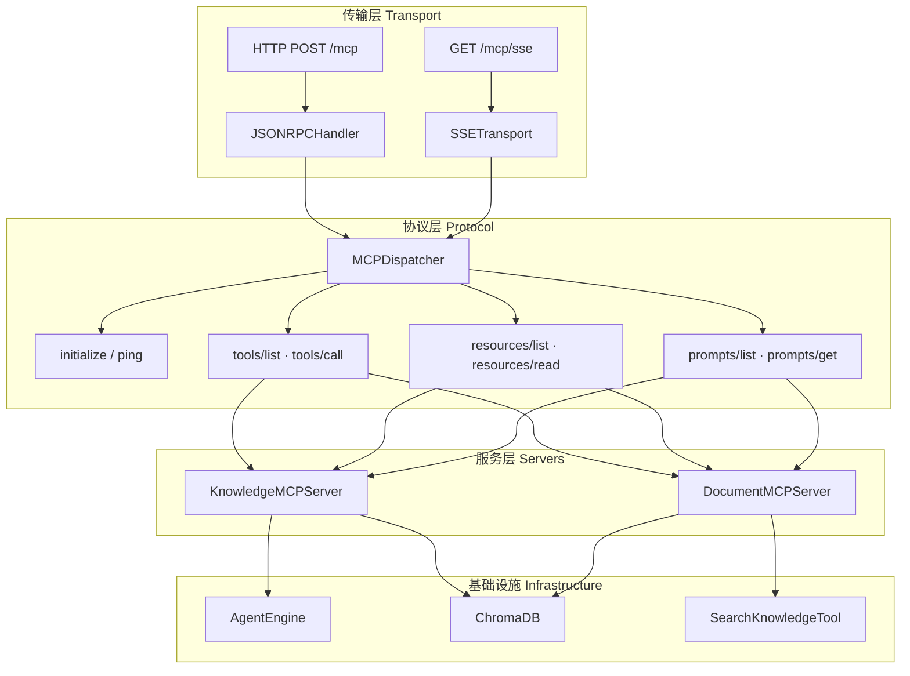
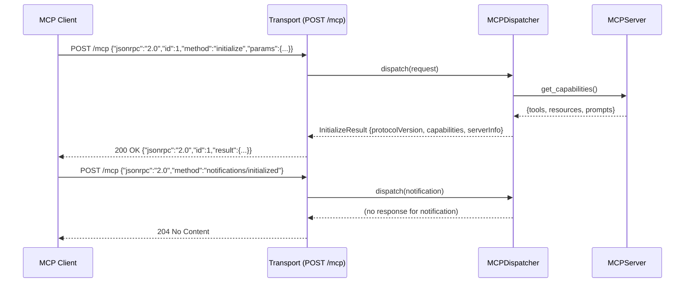
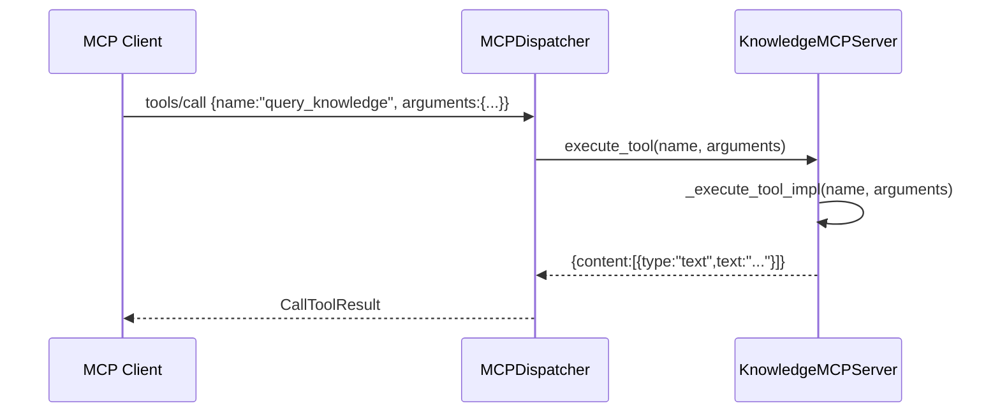
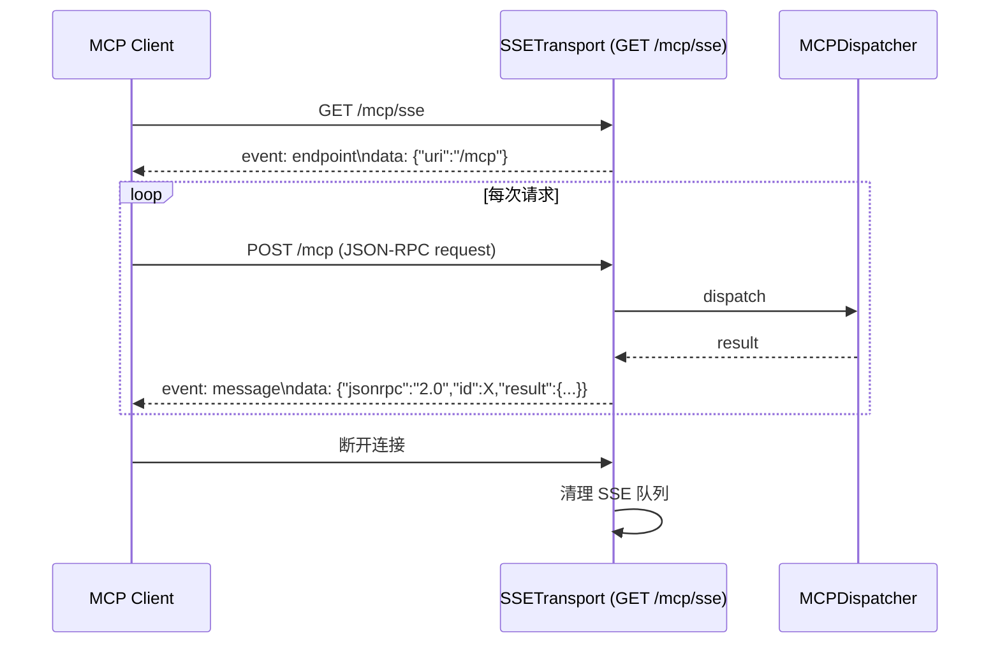

# 设计文档：MCP 标准规范实现（mcp-standard）

## 概述

本设计旨在将现有 `backend/app/mcp/` 模块重构为符合 [MCP 官方规范](https://spec.modelcontextprotocol.io/) 的完整实现，包括 JSON-RPC 2.0 传输层、握手协议、三大能力（tools / resources / prompts）、标准错误码，以及对外暴露的 HTTP/SSE 端点。重构过程中不破坏现有 tools/agents 逻辑，不引入额外第三方依赖（仅使用 FastAPI + asyncio 内置能力）。

当前代码存在以下核心问题：`__init__.py` 与 `base.py` 重复定义相同类；缺少 JSON-RPC 2.0 传输层；缺少 `initialize/initialized` 握手；缺少 `ping/pong` 心跳；缺少 `prompts` 能力；没有 `capabilities` 声明；没有对外 HTTP 路由。本设计将系统性地解决上述所有问题。

---

## 架构

### 整体分层



### 文件结构（重构后）

```
backend/app/mcp/
├── __init__.py          # 仅做 re-export，消除重复定义
├── base.py              # MCPTool / MCPResource / MCPPrompt / MCPServer / MCPServerRegistry
├── protocol.py          # JSON-RPC 2.0 消息模型 + 错误码常量
├── dispatcher.py        # MCPDispatcher：路由 JSON-RPC 方法到对应 Server
├── transport.py         # HTTP handler + SSE 生成器
├── router.py            # FastAPI Router，挂载 /mcp 端点
├── knowledge_server.py  # KnowledgeMCPServer（含 prompts 能力）
└── document_server.py   # DocumentMCPServer（含 prompts 能力）
```

---

## 序列图

### 1. 握手流程（initialize / initialized）



### 2. 工具调用流程（tools/call）



### 3. SSE 流式传输



---

## 组件与接口

### protocol.py — JSON-RPC 2.0 消息模型

```python
# 错误码常量（MCP 规范定义）
class MCPErrorCode:
    PARSE_ERROR      = -32700  # JSON 解析失败
    INVALID_REQUEST  = -32600  # 请求结构非法
    METHOD_NOT_FOUND = -32601  # 方法不存在
    INVALID_PARAMS   = -32602  # 参数非法
    INTERNAL_ERROR   = -32603  # 服务器内部错误
    # MCP 扩展错误码
    RESOURCE_NOT_FOUND = -32002
    TOOL_NOT_FOUND     = -32003
    PROMPT_NOT_FOUND   = -32004

class JSONRPCRequest(BaseModel):
    jsonrpc: Literal["2.0"]
    id: Optional[Union[str, int]]   # None 表示 notification
    method: str
    params: Optional[Dict[str, Any]]

class JSONRPCResponse(BaseModel):
    jsonrpc: Literal["2.0"] = "2.0"
    id: Optional[Union[str, int]]
    result: Optional[Any]
    error: Optional[JSONRPCError]

class JSONRPCError(BaseModel):
    code: int
    message: str
    data: Optional[Any]
```

### base.py — 核心抽象类（重构后）

```python
class MCPTool(BaseModel):
    name: str
    description: str
    inputSchema: Dict[str, Any]   # 改为 camelCase 符合 MCP 规范

class MCPResource(BaseModel):
    uri: str
    name: str
    description: str
    mimeType: str = "text/plain"  # 改为 camelCase

class MCPPrompt(BaseModel):
    name: str
    description: str
    arguments: List[MCPPromptArgument]

class MCPPromptArgument(BaseModel):
    name: str
    description: str
    required: bool = False

class MCPCapabilities(BaseModel):
    tools: Optional[Dict]      # {"listChanged": False}
    resources: Optional[Dict]  # {"subscribe": False, "listChanged": False}
    prompts: Optional[Dict]    # {"listChanged": False}

class MCPServer:
    name: str
    version: str
    
    # 三大能力注册
    def register_tool(self, tool: MCPTool) -> None
    def register_resource(self, resource: MCPResource) -> None
    def register_prompt(self, prompt: MCPPrompt) -> None
    
    # 列举
    def list_tools(self) -> List[MCPTool]
    def list_resources(self) -> List[MCPResource]
    def list_prompts(self) -> List[MCPPrompt]
    def get_capabilities(self) -> MCPCapabilities
    
    # 执行（子类实现）
    async def execute_tool(self, name: str, arguments: Dict) -> Dict
    async def read_resource(self, uri: str) -> str
    async def get_prompt(self, name: str, arguments: Dict) -> Dict
```

### dispatcher.py — 请求分发器

```python
class MCPDispatcher:
    """
    将 JSON-RPC 方法路由到对应的 MCPServer 处理逻辑。
    支持方法：
      initialize, ping,
      tools/list, tools/call,
      resources/list, resources/read,
      prompts/list, prompts/get,
      notifications/initialized (notification, 无响应)
    """
    
    def __init__(self, registry: MCPServerRegistry)
    
    async def dispatch(self, request: JSONRPCRequest) -> Optional[JSONRPCResponse]
    
    # 内部处理方法
    async def _handle_initialize(self, params: Dict) -> Dict
    async def _handle_ping(self) -> Dict
    async def _handle_tools_list(self, params: Dict) -> Dict
    async def _handle_tools_call(self, params: Dict) -> Dict
    async def _handle_resources_list(self, params: Dict) -> Dict
    async def _handle_resources_read(self, params: Dict) -> Dict
    async def _handle_prompts_list(self, params: Dict) -> Dict
    async def _handle_prompts_get(self, params: Dict) -> Dict
```

### router.py — FastAPI 路由

```python
router = APIRouter(prefix="/mcp", tags=["mcp"])

@router.post("")
async def mcp_endpoint(request: Request) -> JSONResponse:
    """HTTP POST 端点，处理单次 JSON-RPC 请求"""

@router.get("/sse")
async def mcp_sse_endpoint(request: Request) -> EventSourceResponse:
    """SSE 端点，建立持久连接并推送消息"""

@router.get("/capabilities")
async def mcp_capabilities() -> JSONResponse:
    """返回所有已注册 Server 的能力声明（调试用）"""
```

---

## 数据模型

### initialize 请求/响应

```python
# 请求 params
class InitializeParams(BaseModel):
    protocolVersion: str          # 客户端支持的协议版本，如 "2024-11-05"
    capabilities: Dict[str, Any]  # 客户端能力
    clientInfo: ClientInfo

class ClientInfo(BaseModel):
    name: str
    version: str

# 响应 result
class InitializeResult(BaseModel):
    protocolVersion: str = "2024-11-05"
    capabilities: MCPCapabilities
    serverInfo: ServerInfo

class ServerInfo(BaseModel):
    name: str    # 如 "knowledge-qa-mcp"
    version: str # 如 "1.0.0"
```

### tools/call 请求/响应

```python
class CallToolParams(BaseModel):
    name: str
    arguments: Optional[Dict[str, Any]]

class CallToolResult(BaseModel):
    content: List[ContentItem]
    isError: bool = False

class ContentItem(BaseModel):
    type: Literal["text", "image", "resource"]
    text: Optional[str]          # type=text 时
    data: Optional[str]          # type=image 时（base64）
    mimeType: Optional[str]
```

### resources/read 响应

```python
class ReadResourceResult(BaseModel):
    contents: List[ResourceContent]

class ResourceContent(BaseModel):
    uri: str
    mimeType: str
    text: Optional[str]   # 文本资源
    blob: Optional[str]   # 二进制资源（base64）
```

### prompts/get 响应

```python
class GetPromptResult(BaseModel):
    description: Optional[str]
    messages: List[PromptMessage]

class PromptMessage(BaseModel):
    role: Literal["user", "assistant"]
    content: ContentItem
```

---

## 错误处理

### 错误码规范

| 错误码 | 常量名 | 触发场景 |
|--------|--------|----------|
| -32700 | PARSE_ERROR | 请求体不是合法 JSON |
| -32600 | INVALID_REQUEST | 缺少 `jsonrpc` 或 `method` 字段 |
| -32601 | METHOD_NOT_FOUND | 调用了未实现的 RPC 方法 |
| -32602 | INVALID_PARAMS | 参数类型错误或缺少必填参数 |
| -32603 | INTERNAL_ERROR | 工具执行时抛出未预期异常 |
| -32002 | RESOURCE_NOT_FOUND | `resources/read` 时 URI 不存在 |
| -32003 | TOOL_NOT_FOUND | `tools/call` 时工具名不存在 |
| -32004 | PROMPT_NOT_FOUND | `prompts/get` 时 prompt 名不存在 |

### 错误响应格式

```python
# 所有错误统一包装为 JSON-RPC error 响应
{
    "jsonrpc": "2.0",
    "id": <原始请求 id 或 null>,
    "error": {
        "code": -32601,
        "message": "Method not found: unknown/method",
        "data": None
    }
}
```

### 错误处理策略

- `tools/call` 中工具执行失败时，**不抛出 JSON-RPC 错误**，而是返回 `isError: true` 的 `CallToolResult`（MCP 规范要求）
- Notification（无 `id` 的请求）不返回任何响应，包括错误
- SSE 连接断开时，服务端静默清理，不记录为错误

---

## 测试策略

### 单元测试

- `protocol.py`：验证 `JSONRPCRequest` / `JSONRPCResponse` 的序列化与反序列化
- `dispatcher.py`：mock MCPServerRegistry，验证每个方法的路由逻辑
- `base.py`：验证 `MCPServer.get_capabilities()` 根据注册内容动态生成

### 属性测试（Property-Based Testing）

**测试库**：`hypothesis`

- 对任意合法 JSON-RPC 请求，`dispatcher.dispatch()` 必须返回合法的 JSON-RPC 响应或 None（notification）
- 对任意非法 JSON 输入，HTTP 端点必须返回 `-32700` 错误，不能抛出 500
- `tools/call` 对不存在的工具名，必须返回 `-32003`，不能返回 200 成功

### 集成测试

- 使用 `httpx.AsyncClient` + FastAPI `TestClient` 测试完整握手流程
- 验证 SSE 端点能正确推送 `endpoint` 事件
- 验证 `KnowledgeMCPServer` 和 `DocumentMCPServer` 的工具调用端到端流程

---

## 性能考量

- SSE 连接使用 `asyncio.Queue` 管理消息队列，避免阻塞
- `MCPServerRegistry` 使用类变量存储，进程内单例，无需每次请求重建
- 工具执行为 `async`，不阻塞事件循环
- 不引入连接池或缓存层（当前规模不需要）

---

## 安全考量

- MCP 端点暂不加认证（与现有 `/api` 路由保持一致，由上层 API Gateway 控制）
- `tools/call` 的 `arguments` 在传入工具前由各 Server 自行校验，防止注入
- SSE 端点不暴露内部错误堆栈，仅返回标准错误码和消息

---

## 依赖

- `fastapi`（已有）：HTTP 路由、请求/响应处理
- `pydantic`（已有）：消息模型验证
- `asyncio`（标准库）：SSE 队列管理
- `sse-starlette`（已有或轻量引入）：SSE 响应支持
  - 若未安装，可用 `StreamingResponse` + `text/event-stream` 手动实现，零额外依赖
- 现有模块：`AgentEngine`、`SearchKnowledgeTool`、`ChromaDB`（无变化）
